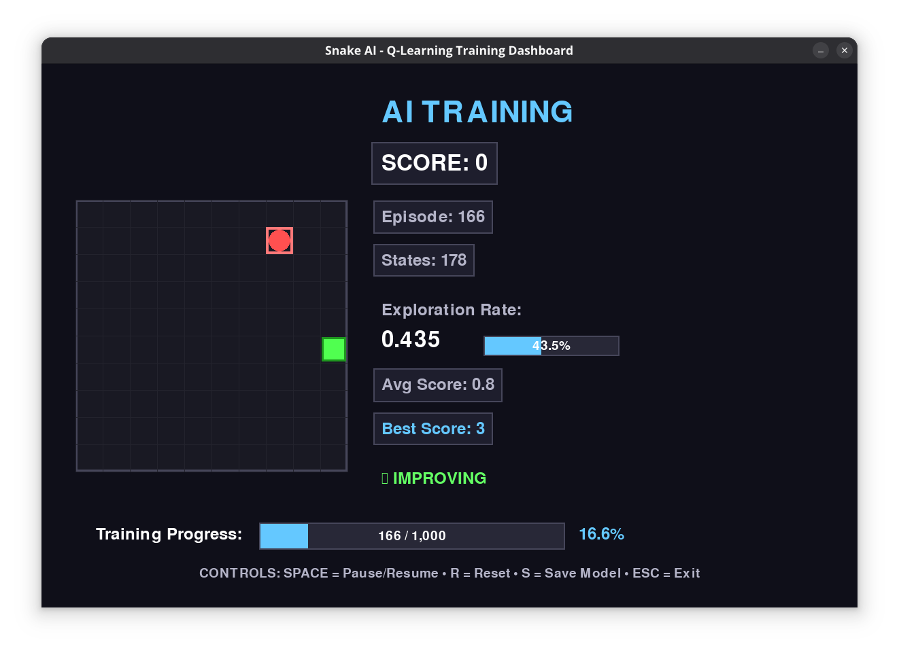

# 🐍 Snake AI - Q-Learning Training Dashboard

[](https://www.python.org/downloads/)
[](https://www.pygame.org/)
[](https://opensource.org/licenses/MIT)
[](https://en.wikipedia.org/wiki/Q-learning)
[](https://github.com/)

A beautiful, modern implementation of the classic Snake game with an AI agent that learns to play using Q-Learning reinforcement learning. Features a professional training dashboard with real-time statistics and performance monitoring.



## ✨ Features

- 🤖 **Q-Learning AI Agent** - Learns to play Snake through trial and error
- 🎨 **Beautiful Modern Interface** - Professional training dashboard with real-time stats
- 📊 **Real-time Performance Monitoring** - Track learning progress, exploration rate, and performance trends
- 💾 **Model Persistence** - Save and load trained models
- 🎮 **Interactive Controls** - Pause, reset, and save during training
- 📈 **Visual Learning Analytics** - Progress bars, trend indicators, and performance metrics

## 🎯 What You'll See

The interface features:
- 🎮 Large, clear game area with enhanced graphics
- 📋 Real-time statistics panel showing score, episodes, and learning progress
- 🔍 Exploration rate visualization with progress bars
- 📈 Performance trend indicators (Improving/Declining/Stable)
- ⏱️ Training progress tracking
- 🌙 Modern dark theme with professional color scheme

## 🚀 Installation

### 📋 Prerequisites

- 🐍 Python 3.7 or higher
- 📦 pip package manager

### 📚 Dependencies

Install the required libraries:

```bash
pip install pygame numpy
```

Or install them individually:

```bash
pip install pygame
pip install numpy
```

### 🏠 Using Virtual Environment (Recommended)

```bash
# Create virtual environment
python -m venv snake_ai_env

# Activate it (Windows)
snake_ai_env\Scripts\activate

# Activate it (macOS/Linux)
source snake_ai_env/bin/activate

# Install dependencies
pip install pygame numpy
```

## 🎮 Usage

### ▶️ Running the Training

```bash
python snake_ai.py
```

### 🎛️ Controls

- **⏸️ SPACE** - Pause/Resume training
- **🔄 R** - Reset training (clear all progress)
- **💾 S** - Save model manually
- **❌ ESC** - Exit application

### 🌟 First Run

On first run, the AI will start learning from scratch. The model will be automatically saved as `snake_q_table.pkl` every 100 episodes and when you exit the program.

### 📂 Loading Existing Model

If a saved model (`snake_q_table.pkl`) exists in the same directory, it will be automatically loaded when you start the program.

## 🧠 How It Works

### 🤖 Q-Learning Algorithm

The AI uses Q-Learning, a model-free reinforcement learning algorithm that learns the quality of actions (Q-values) for different states:

1. **🎯 State Representation**: The game state includes:
   - ⚠️ Danger detection (walls and snake body in each direction)
   - 🍎 Food direction relative to snake head
   - ➡️ Current movement direction
   - 📊 This creates a 12-dimensional boolean state space

2. **🎮 Actions**: The snake can take 3 actions:
   - ⬆️ Continue straight (0)
   - ↗️ Turn right (1)
   - ↖️ Turn left (2)

3. **🏆 Rewards**:
   - ✅ +10 for eating food
   - ❌ -10 for collision (game over)
   - ⏰ -0.1 for each step (encourages efficiency)
   - 🔄 -5 for taking too long without eating (prevents infinite loops)

4. **⚙️ Learning Parameters**:
   - 📚 Learning rate (α): 0.1
   - 🔮 Discount factor (γ): 0.95
   - 🎲 Exploration rate (ε): Starts at 1.0, decays to 0.01

### 🔄 Training Process

1. **🎲 Exploration Phase**: Initially, the AI explores randomly (high ε value)
2. **📚 Learning Phase**: As training progresses, the AI gradually exploits learned knowledge
3. **🎯 Convergence**: Eventually, the AI develops optimal strategies for playing Snake

## 📁 Project Structure

```
snake_ai/
│
├── 🐍 snake_ai.py           # Main game and AI implementation
├── 💾 snake_q_table.pkl     # Saved Q-table (created after training)
├── 📸 screenshot.png        # Project screenshot
└── 📖 README.md            # This file
```

## 🏗️ Code Structure

### 🧩 Main Classes

- **`🎮 SnakeGame`** - Game logic and environment
- **`🤖 QLearningAgent`** - AI agent with Q-learning implementation
- **`🎨 GameRenderer`** - Modern UI and visualization

### 🔧 Key Methods

- `get_state()` - Converts game situation to state representation
- `choose_action()` - Epsilon-greedy action selection
- `update()` - Q-value updates using Bellman equation
- `render()` - Beautiful dashboard rendering

## 📊 Performance Metrics

The dashboard displays several key metrics:

- **🏆 Score** - Current game score
- **🎬 Episode** - Number of games played
- **🧠 States** - Number of unique states learned
- **🎲 Exploration Rate** - Current ε value (exploration vs exploitation)
- **📈 Average Score** - Running average of last 100 games
- **👑 Best Score** - Highest score achieved
- **📊 Performance Trend** - Whether AI is improving, declining, or stable

## 💡 Training Tips

1. **🌱 Initial Learning**: The first few hundred episodes will show poor performance as the AI explores
2. **📈 Improvement Phase**: Around episodes 500-1000, you should see steady improvement
3. **🎯 Convergence**: After 1000+ episodes, performance should stabilize at a high level
4. **⏳ Patience**: Q-Learning can take time to converge - let it run for several thousand episodes

## 🎛️ Customization

### ⚙️ Adjusting Learning Parameters

In the `QLearningAgent` class constructor:

```python
agent = QLearningAgent(
    alpha=0.1,        # 📚 Learning rate
    gamma=0.95,       # 🔮 Discount factor
    epsilon=1.0,      # 🎲 Initial exploration rate
    epsilon_decay=0.995,  # 📉 Exploration decay rate
    epsilon_min=0.01  # 🎯 Minimum exploration rate
)
```

### 🎮 Modifying Game Settings

In the constants section:

```python
GRID_SIZE = 40        # 📏 Size of each grid cell
GRID_WIDTH = 10       # ↔️ Number of cells horizontally
GRID_HEIGHT = 10      # ↕️ Number of cells vertically
WINDOW_WIDTH = 1200   # 🖥️ Window width
WINDOW_HEIGHT = 700   # 🖥️ Window height
```

### 🎨 Changing Visualization

The `GameRenderer` class contains all visual settings including colors, fonts, and layout parameters.

## 🔧 Technical Details

- **💻 Language**: Python 3.7+
- **🎮 Graphics**: Pygame
- **🤖 AI Algorithm**: Q-Learning (Tabular)
- **📊 State Space**: Discrete (2^12 possible states)
- **🎯 Action Space**: Discrete (3 actions)
- **💾 Model Persistence**: Pickle format

## 🔧 Troubleshooting

### ⚠️ Common Issues

1. **📦 Module not found**: Make sure pygame and numpy are installed
2. **🐌 Slow performance**: Try reducing `render_every` parameter or window size
3. **📉 No improvement**: Increase training episodes or adjust learning parameters
4. **💾 Save/load errors**: Ensure write permissions in the project directory

### ⚡ Performance Optimization

- 🖥️ Reduce `render_every` to update display less frequently
- 📱 Decrease window size for faster rendering
- ⚡ Adjust `epsilon_decay` for faster convergence

## 📄 License

This project is open source and available under the MIT License.

## 🙏 Credits

- 🐍 Built with Python and Pygame
- 🤖 Uses Q-Learning reinforcement learning algorithm
- 🎨 Modern UI design inspired by professional ML dashboards

## 🤝 Contributing

Feel free to fork this project and submit pull requests for improvements. Some areas where contributions would be welcome:

- 🧠 Additional AI algorithms
- ⚡ Performance optimizations
- 🎨 UI/UX improvements
- 📊 Better state representations
- 📚 Documentation improvements

---

**🎉 Happy Learning!** Watch your AI master the game of Snake through the power of reinforcement learning! 🐍🤖